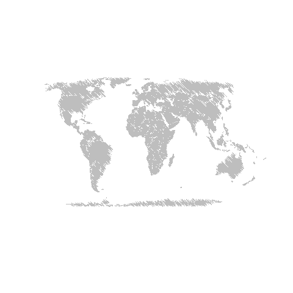
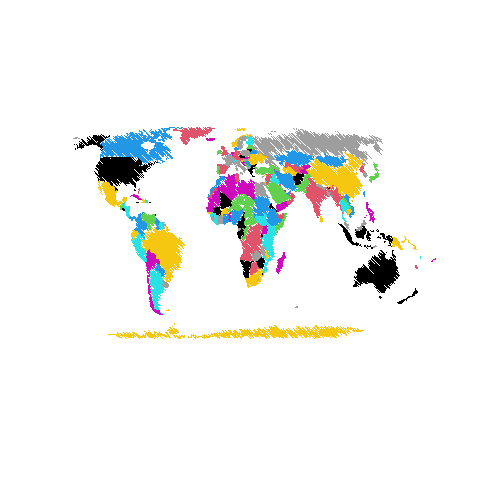
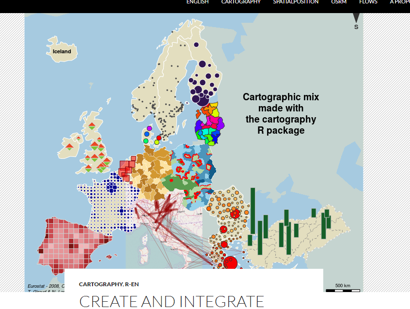

```{r setup, include=FALSE}
options(htmltools.dir.version = FALSE)
```

```{r xaringan-themer, include=FALSE, warning=FALSE}
library(xaringanthemer)
style_duo_accent(
  primary_color = "#1381B0",
  secondary_color = "#FF961C",
  inverse_header_color = "#FFFFFF"
)
```

class: center, middle

# Representação de dados espaciais no R

---

## Packages para manipulação de dados espaciais no R

Package | utilização
--------|-----------
raster | informações espaciais matriciais
OpenStreetMap | dados o OSM
RgoogleMaps | dados do Google Maps
grid | dividir a representação em mais de um mapa
rgdal | ler e escrever dados espaciais
tidyverse | organização de dados
GISTools | ler e escrever dados espaciais
sf | manipulação de dados espaciais
tmap | mapas temáticos

---

## Introdução aos packages `sp` e `sf`

O package `sf` é uma evolução do package `sp`. Na maioria dos casos, é interessante utilizar o `sf`, mas para algumas implementações, como por exemplo o uso de funções no `spdep` para técnicas de análise espacial, faz-se necessária a utilização do `sp`. 


### Dados espaciais `sp`
Por meio do package `sp` é possível definir classes (ou objetos `sp`) para manipulação de dados vetoriais pontos, linhas e polígonos. 

Formatos de dados espacais no R

Sem atributos | Com atributos | Equivalente ESRI
--------------|---------------|-----------------
SpatialPoints | SpatialPointsDataFrame | Point shapefiles
SpatiaLines | SpatialLinesDataFrame | Line shapefiles
SpatialPolygons | SpatialPolygonsDataFrame | Polygon shapefiles

---

### Dados espaciais GISTools

O package `GISTools` vem com diferentes bancos de dados que podem ajudar no entendimento das funções. Utilizaremos dois conjuntos dados para explorar as funcionalidades deste package, a saber:   

(i) dados representados em linhas e polígonos referentes aos municípios na Georgia, considerando New Haven e Connecticut nos EUA. Os dados de New Haven contemplam dados de estatísticas de crimes, rodovias, informações demográficas, ferrovias e locais. 

(ii) O dado da Georgia inclui os limites municipais com alguns atributos relacionados aos dados de 1990 (população total, população rural, que tem curso superior, estrangeira, idosos, linha da pobreza, negros, renda média).

---
### Dados espaciais GISTools
Para carregar os dados, utilize a função `data()`. 

```{r echo = TRUE, message=FALSE, warning=FALSE, include=TRUE}
library(GISTools)
data(newhaven)
ls() # inspecionar os dados
```

Verifique as classes dos objetos:

```{r echo = TRUE, message=FALSE, warning=FALSE, include=TRUE}
class(breach)
class(blocks)
```

---
### Dados espaciais GISTools

Os dados associados ao objeto `blocks` podem ser visualizados por meio da função:

```{r echo = TRUE, message=FALSE, warning=FALSE, include=TRUE}
head(data.frame(blocks))
```

---
### Dados espaciais GISTools

O data frame de um objeto espacial `sp` também pode ser acessado por meio de `@data`:

```{r echo = TRUE, message=FALSE, warning=FALSE, include=TRUE}
head(blocks@data)
```

---
### Dados espaciais GISTools

Os dados das unidades censitárias de New Haven podem ser visualizados por meio de:

```{r echo = TRUE, message=FALSE, warning=FALSE, include=TRUE}
plot(blocks)
```

---

### Dados espaciais `sf`

Uma nova classe de objetos espaciais no R foi definida por meio do package denominado `sf`. O objetivo de desenvolvimento deste package é padronizar o formato dos dados espaciais. 

```{r echo=FALSE, message=FALSE, warning=FALSE, out.width="60%", fig.align = 'center'}
knitr::include_graphics("./sf.png")
```

---
### Dados espaciais `sf`

Tipo |	Descrição
-----|-----------
POINT	|zero-dimensional geometry containing a single point
LINESTRING	|sequence of points connected by straight, non-self intersecting line pieces; one-dimensional geometry
POLYGON	|geometry with a positive area (two-dimensional); sequence of points form a closed, non-self intersecting ring; the first ring denotes the exterior ring, zero or more subsequent rings denote holes in this exterior ring
MULTIPOINT|	set of points; a MULTIPOINT is simple if no two Points in the MULTIPOINT are equal
MULTILINESTRING	|set of linestrings
MULTIPOLYGON	|set of polygons
GEOMETRYCOLLECTION	|set of geometries of any type except GEOMETRYCOLLECTION

---
### Lendo e escrevendo dados espaciais no R

As funções do `rgdal` para ler e escrever dados espaciais são, respectivamente: `readOGR()` e `writeOGR()`. O objeto `georgia` em `sp` pode ser convertido em _shapefile_ como a seguir:

```{r eval=FALSE, message=FALSE, warning=FALSE, include=TRUE, results ='hide'}
library(rgdal)
writeOGR(obj=georgia, dsn="./shapefiles", layer="georgia", driver="ESRI Shapefile", overwrite_layer=TRUE)
readOGR(dsn="./shapefiles/georgia.shp")
```

---
### Lendo e escrevendo dados espaciais no R

O package `sf` também tem funções que permitem ler e escrever dados espaciais. As funções para isso são `st_read()` e `st_write()`.

```{r eval=FALSE, message=FALSE, warning=FALSE, include=TRUE, results ='hide'}
setwd("./shapefiles/")
g2 <- st_read("georgia.shp")
```

O diretório deve ser especificado para que os dados espaciais sejam varridos de forma efetiva pelas funções. Para escrever utilizando a função `st_write()` são necessários dois parâmetros: o objeto e o nome do arquivo. 

```{r eval=FALSE, message=FALSE, warning=FALSE, include=TRUE, results ='hide'}
st_write(g2, "georgia.shp", delete_layer = TRUE)
```

---
### Uma introdução ao package `tmap`

O package `tmap` permite o uso de novas funcionalidades para gerar mapas e funções para extração de dados do Google Maps e do OpenStreetMap. O foco do package `tmap` é a construção de mapas temáticos. Podem ser considerados dados `sp` e `sf`. A gramática para construção dos mapas é similar àquela do package `ggplot`. Assim, a representação de dados espaciais por meio do `tmap` conta com a manipulação de cada elemento do mapa separadamente em diferentes camadas. 

```{r}
library(tmap)
data(World)
```

---
### Uma introdução ao package `tmap`
```{r fig.align = 'center'}
tm_shape(World) +
    tm_polygons("HPI", n = 9, palette = "div",
        title = "Happy Planet Index", id = "name") +
tm_style("gray") +
tm_format("World")
```
--- 

### Sistemas de coordenadas

Verificar qual o sistema de referência em uso de dados espaciais vetoriais

```{r echo=TRUE, message=FALSE, warning=FALSE}
library(sf)
st_crs(World)
```
---
### Sintaxe `Proj4`

Parâmetro | Significado
----------|-------------
+a       |  Semimajor radius of the ellipsoid axis
+b       |  Semiminor radius of the ellipsoid axis
+datum    | Datum name 
+ellps    | Ellipsoid name 
+lat_0    | Latitude of origin
+lat_1    | Latitude of first standard parallel
+lat_2    | Latitude of second standard parallel
+lat_ts   | Latitude of true scale
+lon_0    | Central meridian
+over     | Allow longitude output outside -180 to 180 range, disables wrapping 
+proj     | Projection name 
---

### Sintaxe `Proj4`

Parâmetro | Significado
----------|-------------
+south    | Denotes southern hemisphere UTM zone
+units|     meters, US survey feet, etc.
+x_0   |    False easting
+y_0    |   False northing
+zone    |  UTM zone

---
### Como salvar meu mapa

pdf(file = 'map.pdf')

---
## Outras coisinhas fofas

```{r echo=FALSE, message=FALSE, warning=FALSE, out.width="60%", fig.align = 'center'}

```
---
## Outras coisinhas fofas

```{r echo=FALSE, message=FALSE, warning=FALSE, out.width="60%", fig.align = 'center'}

```
---
## Outras coisinhas fofas

```{r echo=FALSE, message=FALSE, warning=FALSE, out.width="60%", fig.align = 'center'}

```
---

class: inverse, center, middle

# Dúvidas?

